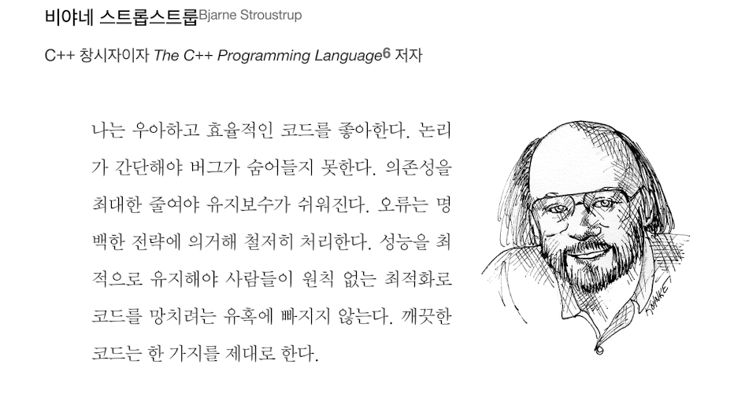
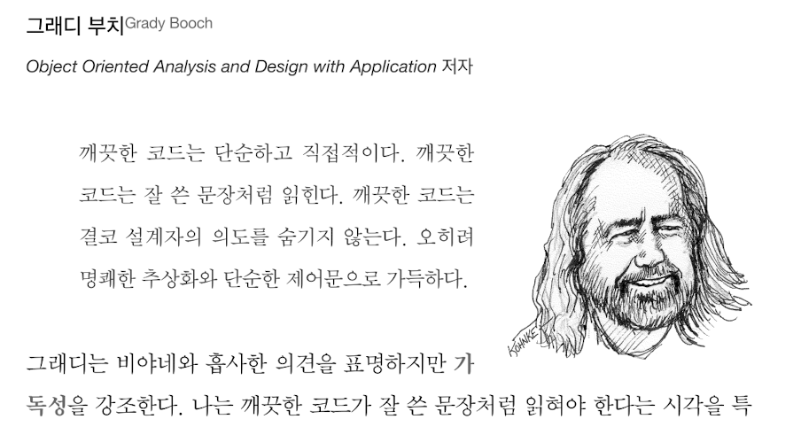

# 1장 깨끗한 코드

## 코드란 무엇일까?

1장에서 이 책의 제목(주제)인 CleanCode를 다루기에 앞서 코드란 무엇인지부터 짚고 넘어간다.
코드는 요구사항을 상세히 표현하는 수단이라고 한다. 조금 더 명확하게 표현하자면 __"기계가 실행할 정도로 상세하게 요구사항을 명시하는 작업"__ 을 의미한다.

>최근에 가졌던 고민사항: AI가 코딩하는 시대가 온다면 개발자의 역할은 어떻게 될까?

사람과 사람 사이의 관계에서 발생하는 요구사항을 해결하는데 있어서도 완벽하게 해결하지 못하는만큼 언제나 문제는 발생할 것이고, 기계가 그것을 대체할 수는 없다.
사람이 기계처럼 단순해지지 않는 이상 코드는 언제나 존재할 것이다.

> __더 나은 개발자를 목표로__

하지만 안심하지 말자. 대다수의 단순하고 직관적인 문제들은 AI를 통한 코드로도 해결할 수 있다. 나는 AI를 통해 단순한 문제만 해결하는 개발자가 아닌 더 나은 개발자가 되어야한다.
복잡하게 엉킨 문제를 관리하기 쉽게, 명확하고 직관적으로 풀어낼 수 있는 해결사가 되는 것을 목표로 공부를 해야겠다.

> __나중은 결코 오지 않는다.__

코드를 개발하는데 있어 지금 당장을 모면하기 위한 태도는 버려야한다.
훈련하고 단련해서 평소에도 명확하게 깨끗한 코드를 구현할 줄 알아야 더 나은 개발자라고 생각하기에 항상 지금에 집중해야지.

---

## CleanCode(깨끗한 코드)는 어떻게 작성할까?

> __그래서 깨끗한 코드는 무엇일까?__

책에서는 여러 개발자들의 생각을 적어놓았다.

  - 논리가 간단해야 버그가 생길 요소가 없다.
  - 의존성을 최대한 줄여야 유지보수가 편하다.
  - 오류는 __명백한 전략__ 에 의거해 철저하게 처리해야한다.
  - 클린코드는 한 가지를 제대로 한다.

  - 깨끗한 코드는 __단순__ 하고 __직접적__ 이다.
  - 잘 쓴 문장처럼 읽혀야 한다.
  - __설계자의 의도__ 를 숨기지 않는다.
  - 명쾌한 추상화와 단순한 제어문으로 가득하다.

여러 사람들이 다양한 표현으로 클린코드에 대한 의견을 내놓았는데, 초반의 두 사람의 이야기와 크게 벗어나지 않는다는 생각이 들었다.

---
내가 느낀 깨끗한 코드의 공통적인 사항을 정리해보자면

> 1. 의도하는 바를 명확하게 표현하며
> 2. 주어진 목적을 확실하게 수행하고 
> 3. 예외사항을 충분하게 고려해야 한다.
> 4. 추가적으로 중복은 없어야한다.(프로그램의 디자인 요소적으로 고려할 부분)

이렇게 압축되는 것 같다.

개발자로서, 내가 중요하게 생각하는 덕목 중 하나는 의사소통이다. 
동일한 의미로 코드도 마찬가지라고 느꼈다.
하나의 기능을 아무 이상없이 명확하게 처리하는 코드들의 집합으로 프로그램이 구성될 때
더 나은 개발자로서 나아갈 수 있지 않을까?
소감이 조금 밋밋한 것 같은데, 이건 점차 나아지겠지.
우선 1장 소감 끝.