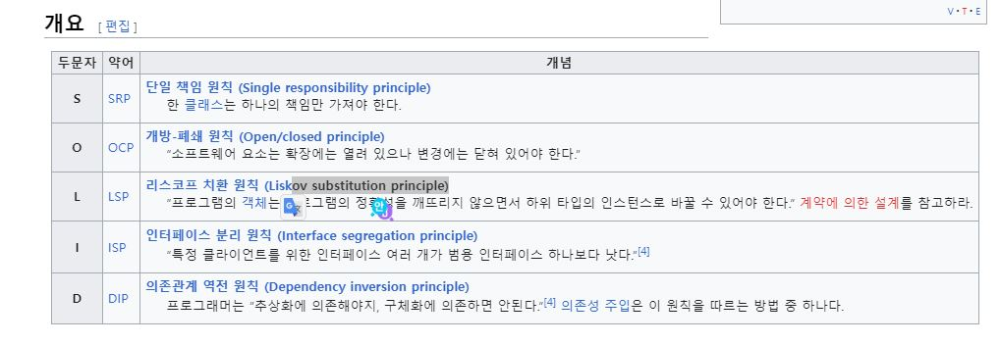

# DesignPattern - SOLID

## 목차 

  - [소개]
  - [단일책임 원칙(SRP)](#single-responsibility-principle단일책임-원칙)
  - [개방폐쇄원칙(OCP)](#openclosed-principle개방-폐쇄-원칙)
  - [리스코프 치환 원칙(LSP)](#liskov-substitution-principle리스코프-치환-원칙)
  - [인터페이스 분리 원칙](#interface-segregation-principle인터페이스-분리-원칙)
  - [의존관계 역전 원칙](#dependency-inversion-principle의존관계-역전-원칙)

 

### 참고 자료 
- [메타코딩](https://youtu.be/0zgnMInEx2s)
- [블로그](https://onlyfor-me-blog.tistory.com/351)

---
 

### SOLID란?

  - 객체지향 프로그래밍 및 설계의 다섯가지 기본 원칙
  - 프로그램의 유지보수와 확장이 쉬운 시스템을 만들고자 할 때 고려하여 디자인하자.
  - **절대적인 명제는 아님** 어겼다고 해서 죄책감 가지지 말자!!
  

---
 

### Single Responsibility principle(단일책임 원칙)
- 하나의 클래스는 하나의 책임을 가져야한다.
- 클래스를 변경하는 이유가 한 가지이기 위해선 하나의 활동에 대한 책임만 가지고 있어야 명확하게 변경할 수 있다.

### 변경 전

- [01.SRPCode](codeSample/01.SRPCode.md)
  - 변경전의 내용을 보면 손님은 두 가지 문제에 봉착한다.
    1. 청구서 계산에 변경이 생길 경우(calculateBill)
    2. 생성할 보고서 유형이 추가될 경우(generateReport)
  - 상식적으로 손님이 계산서를 수정하거나, 보고서를 작성하지 않는다.
  - 두 개의 활동은 각각 다른 클래스를 작성하여 손님 클래스에 넣어준다.

### 변경 후
- [01.손님클래스](codeSample/01_1.makeClassCustomer.md)
  - 기본 클래스와 필드값을 선언
  - getter/setter 세팅을 해둔다.
- [02.계산서클래스](codeSample/01_2.makeClassCalculate.md)
  - 활동이 이뤄질 손님 클래스와 인자값을 받아 처리하는 메서드를 구현한다
  
- [03.보고서클래스](codeSample/01_3.makeClassReport.md)
  - 활동이 이뤄질 손님 클래스와 보고서를 받아 처리하는 메서드를 구현한다.

---
 

### Open/Closed principle(개방-폐쇄 원칙)

---
 

### Liskov substitution principle(리스코프 치환 원칙)

---
 

### Interface segregation principle(인터페이스 분리 원칙)

---
 

### Dependency inversion principle(의존관계 역전 원칙)