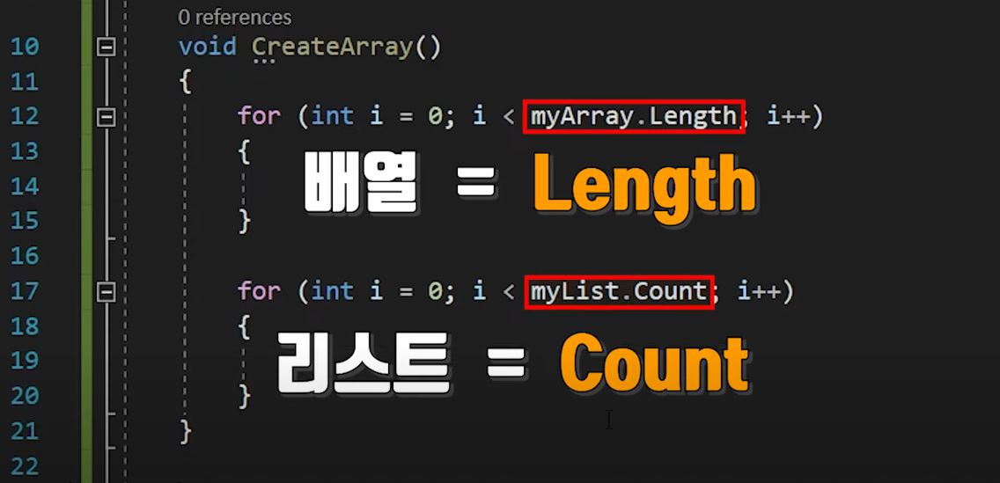
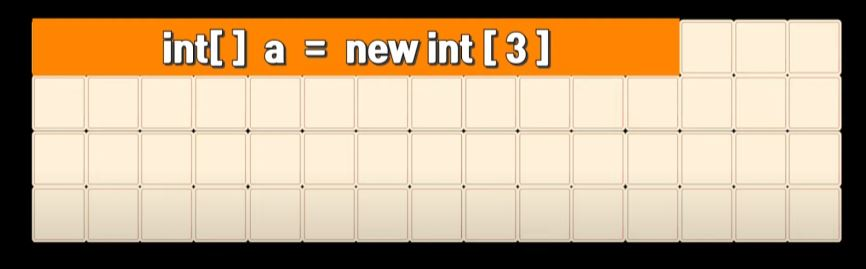
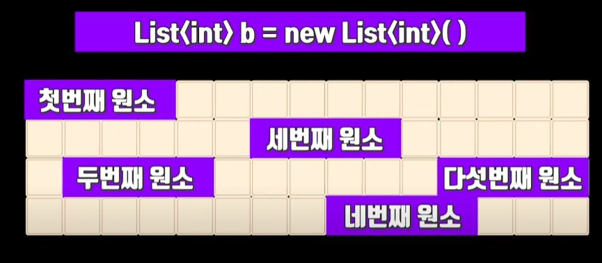

# Array.Length VS List.Count 

## 목차

- [1. 질문 내용](#1-질문-내용)
- [2. 이유](#2-이유)

---

### 1. 질문 내용

> 빈번하게 사용하는 Array와 List는 종종 그 크기를 확인해야 할 때가 있다.
> 그런데 왜 Array는 Length로, List는 Count로 크기를 확인하는 것일까?

### 2. 이유

> 이유는 컴퓨터의 배열과 리스트의 저장방식의 차이가 있기 때문이다.
> 배열의 경우 선언시 그 크기가 이미 고정된 상태로 메모리 공간을 차지 한다.
> 리스트의 경우 선언 이후 요소의 크기가 변동되는 경우가 많기 때문에 메모리 공간에 임의적으로 분배되듯 저장된다.

> Array의 선언시 저장공간을 차지하는 방식
>

> List 선언시 저장공간을 차지하는 방식
> 
