# VSCode 단축키 모음

## 목차 

- [1. Command Palette(커맨드 팔레트)](#1-command-palette커맨드-팔레트)
- [2. Quick Open(퀵오픈)](#2-quick-open퀵오픈)
- [3. Toggle Sidebar(사이드 바 토글)](#3-toggle-sidebar사이드-바-토글)
- [4. Toggle Terminal(터미널 토글)](#4-toggle-terminal터미널-토글)
- [5. Keyboard Shortcut(키보드 단축키)](#5-keyboard-shortcut키보드-단축키)
- [6. CursorMove (커서이동 + 상하좌우)](#6-cursormove-커서이동--상하좌우)
- [7. LineAction (라인 작업)](#7-lineaction-라인-작업)
- [8. Multi Selection (단어 다중 선택)](#8-multi-selection-단어-다중-선택)
- [9. UndoCursor (커서 이전 위치 이동)](#9-undocursor-커서-이전-위치-이동)
- [10. CursorAction (커서 작업)](#10-cursoraction-커서-작업)

--- 

### 1. Command Palette(커맨드 팔레트)

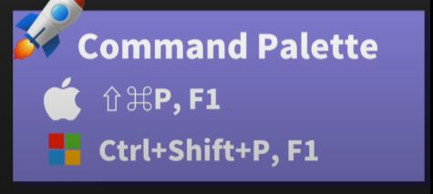

> 마우스 없이 키보드로 작업 가능해짐
> 
> 키워드 검색 또는 이니셜로 검색 가능

---

### 2. Quick Open(퀵오픈)

> 해당하는 파일로 이동가능
> 세팅에서 내가 원하는 대로 수동 설정 가능
>

---

### 3. Toggle Sidebar(사이드 바 토글)

> 프로젝트 익스플로러 등 사이드 바 열고 닫기

---

### 4. Toggle Terminal(터미널 토글)

> 터미널 찾는다고 고생하지 말자.

---

### 5. Keyboard Shortcut(키보드 단축키)

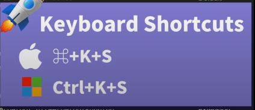

단축키 목록들 파일은 아래 링크 클릭

> 영문판
>- [윈도우즈 숏컷](./image/keyboard-shortcuts-windows.pdf)
>- [맥OS 숏컷](./image/keyboard-shortcuts-macos.pdf)
>
> 한글판
>- [윈도우즈 숏컷](./image/keyboard-shortcuts-windows_korean.pdf)

---

### 6. CursorMove (커서이동 + 상하좌우)

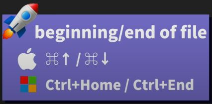
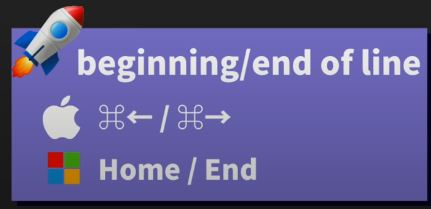

> 파일의 시작과 끝 지점으로 이동
> 라인의 시작과 끝 지점으로 이동
> ctrl + 좌우 이동시 단어별 이동
> ctrl + shift + 이동시 단어별 선택

---

### 7. LineAction (라인 작업)

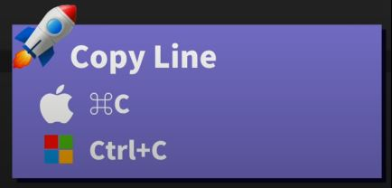

> - 라인 복사하기
> 
> 커서 있는 위치에서 Alt + Shift + 방향키(위/아래) 입력시 해당 방향으로 라인 복사 됨

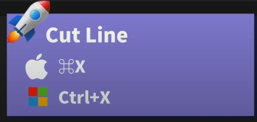

> - 라인 잘라내기

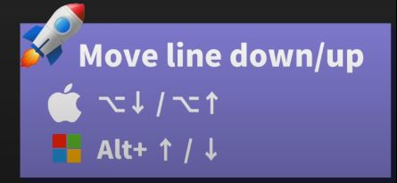

> - 라인 이동하기

> - 해당 줄에서 바로 다음 줄로 이동하기(굳이 커서 끝에 이동해서 enter로 이동 하지 말자)

---

### 8. Multi Selection (단어 다중 선택)

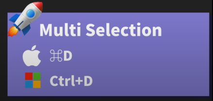

> - 해당 단어 위에서 Ctrl+D를 여러번 누르면 다중 선택이 된다.

---

### 9. UndoCursor (커서 이전 위치 이동)

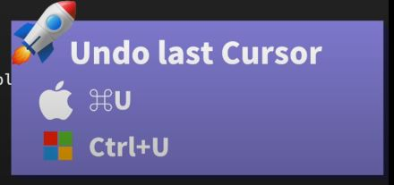

> - 파일 내 이전 위치로 커서 이동시 사용하자

---

### 10. CursorAction (커서 작업)

> - 하나하나 클릭해서 커서를 해당 위치에 추가할 수 있다.

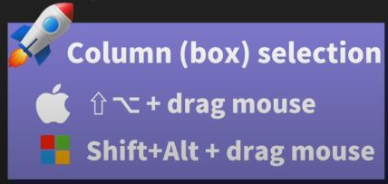

> - 마우스로 클릭하는게 아닌 드래그로 추가할 수 있다 

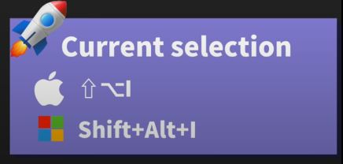

> - 키보드로만 커서 생성하고 싶을 경우 라인들을 블럭선택 후 단축키 입력하면 라인 끝에 일괄 생성된다.

