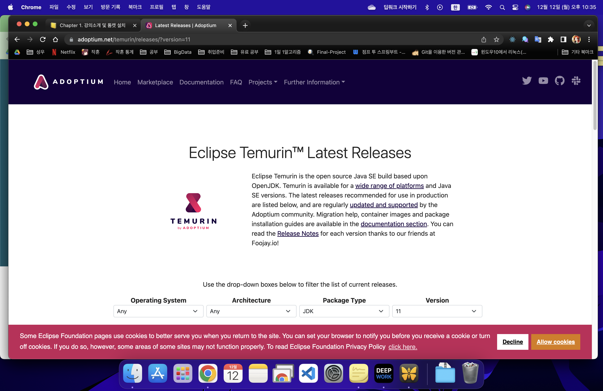
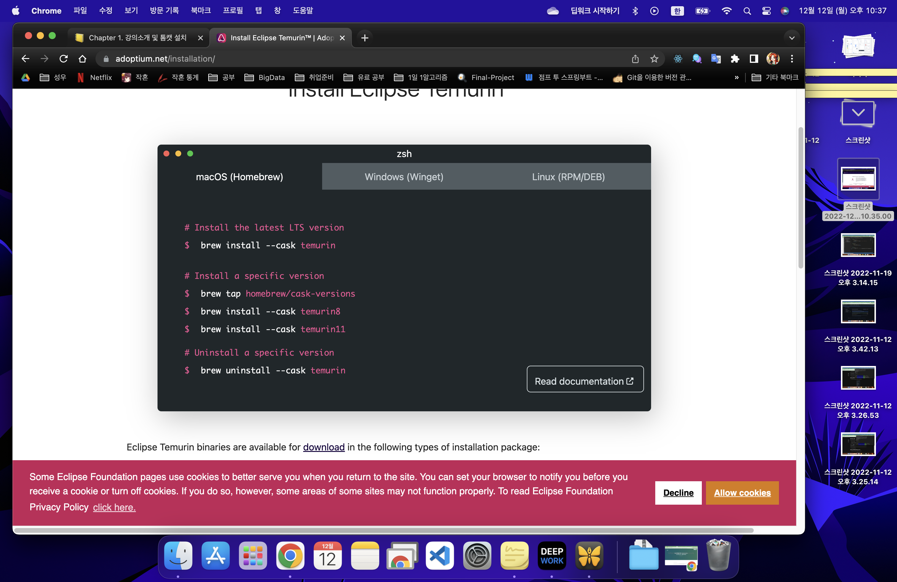
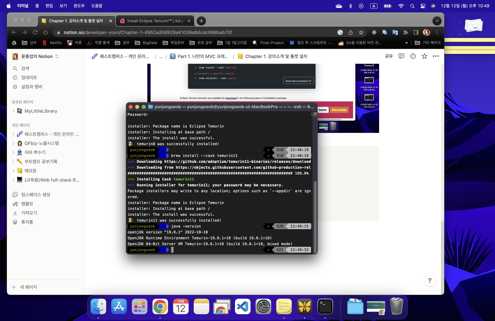
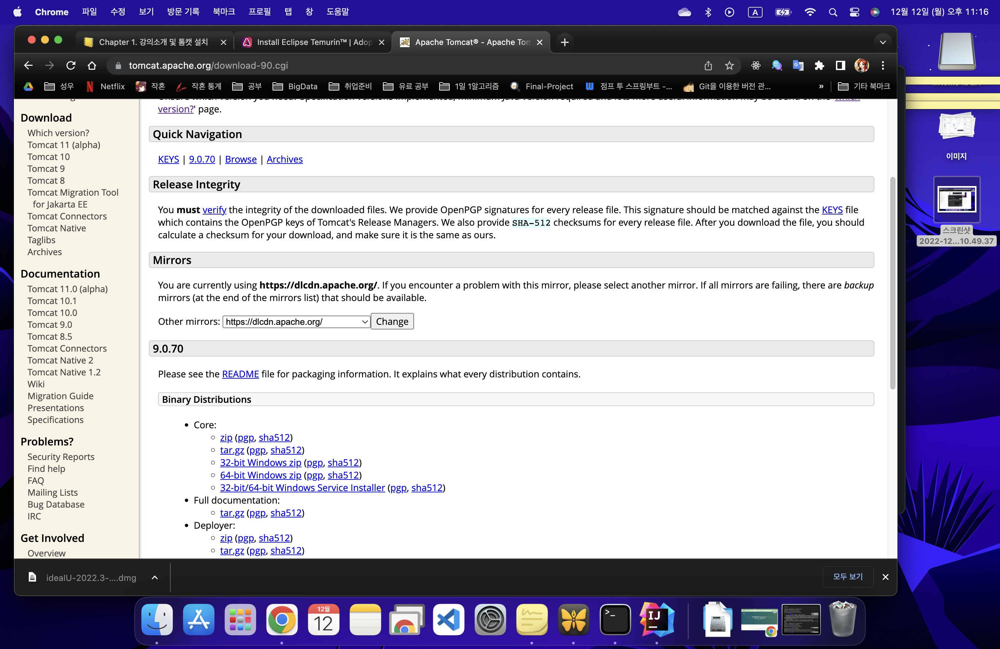
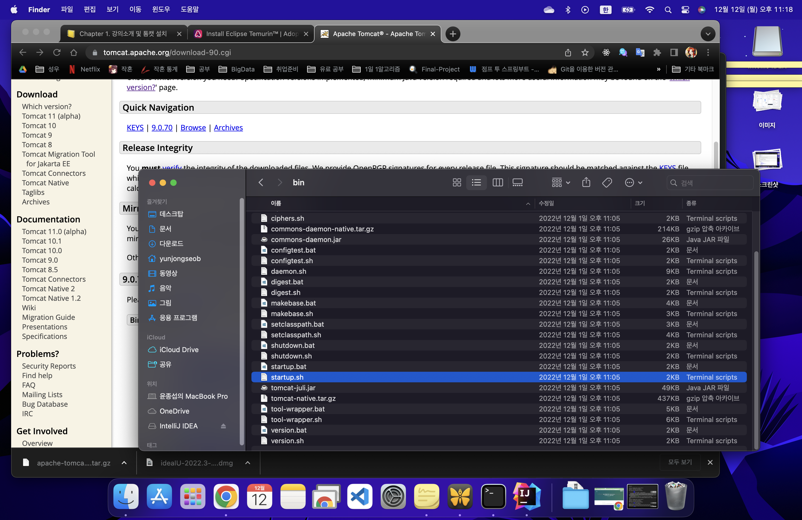
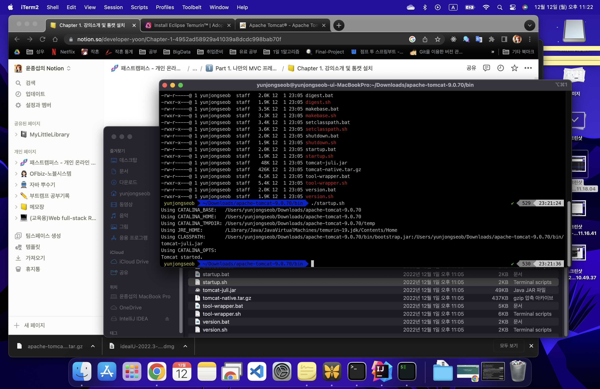
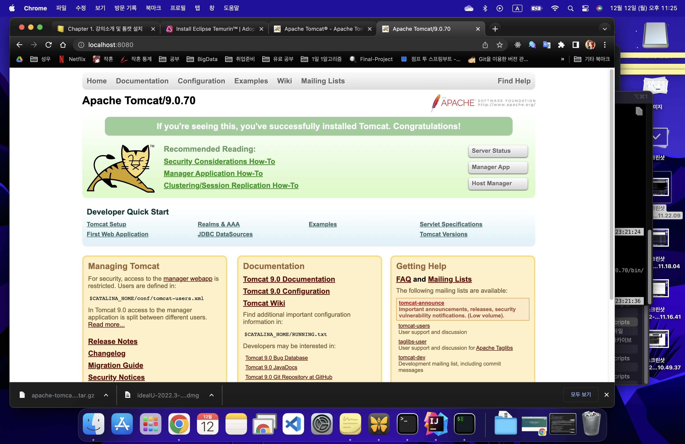
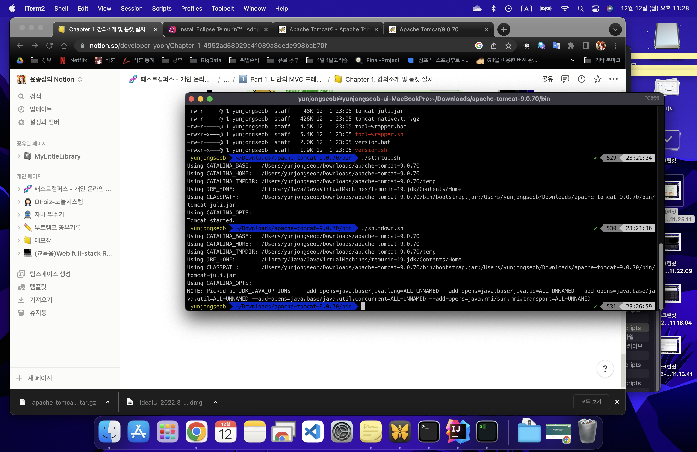
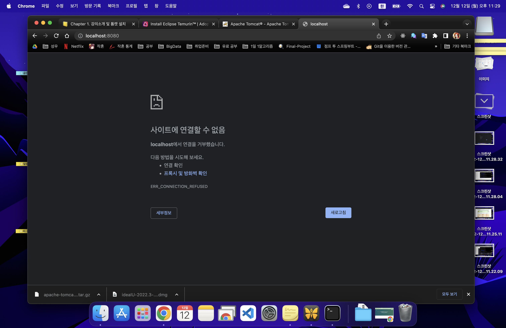

# Chapter 1.  강의소개 및 톰캣 설치

언제나 공부할 땐 목차를 훑어주는 것이 인지상정.

각 챕터에 대한 간단한 설명을 들은 뒤 톰캣 설치로 넘어갔다. 

어차피 맥북으로 공부할 예정이니 맥북으로 설치하는 과정 캐치 할 예정.

1. 설치하는 것은 temurin(테무린)이라는 이클립스 인 듯 하다. 자바 버전은 11로 확인

[테무린 링크](https://adoptium.net/temurin/releases/?version=11)



- 상단의 Documentation으로 가서 설치를 따라갔다.



```jsx
brew install --cask temurin

brew tap homebrew/cask-versions
brew install --cask temurin8
brew install --cask temurin11

brew uninstall --cask temurin
```

열심히 설치해서 최종적으로 설치 완료.



난 사실 테무린 11로 설치하려 했는데, 자기가 먼저 19버전으로 업데이트 진행했다;;

그래서 추가적으로 각각 테무린8과 11을 설치 진행.

아.. 이참에 인텔리제이 결제했다…. ㅠㅠ

열심히 해보자 이참에. 

- 다음으로 톰캣 설치

[톰캣 링크](https://tomcat.apache.org/)

링크로 가서 톰캣을 설치했다.
톰캣의 간단한 설명

- Servlet Interface(Spec) 구현체
- Servlet Container 중 하나

톰캣 홈페이지에서 9버전 맥용인 tar파일을 다운받아 설치했다.





다운 받은 tar를 압축 해제한 뒤 bin 에서 [startup.sh](http://startup.sh) 실행

```jsx
// 쉘 명령어 모드로 해당 경로에 가서 실행하도록 명령했다.
$ cd Download/apache-tomcat-9.0.70/bin/startup.sh

```

그 결과로 톰캣 서버가 제대로 구동중인지 확인 가능

<aside>
💡 Tomcat started를 확인한다

</aside>



톰 캣이 정상적으로 동작하는지 확인해보자.

>>localhost:8080/



종료는 터미널에서 셧다운 명령을 입력하면 된다.

```jsx
$ cd Download/apache-tomcat-9.0.70/bin/shutdown.sh
```



정상적으로 종료되었다면 웹 페이지가 뜨지 않는다.




내일은 도커 환경구성 할 듯 하다.
잊지말고 가자.