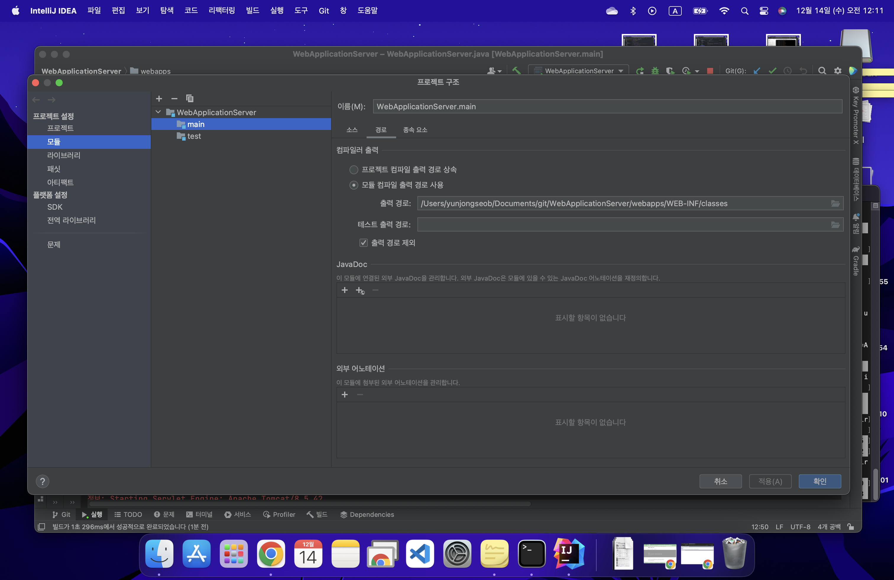

# Chapter 2. 개발환경 구성하기

자바 프로젝트를 하나 생성했다. 

다운 받았던 테무린 11버전으로 생성한 뒤 빌드구축을 완성하고, 기본 리펙터링 완료.

### 1. 새로운 프로젝트 생성했다.

- 언어: 자바
- 빌드: Gradle
- JDK: 테무린 11


프로젝트 생성 후 빌드작업이 완료된 뒤에 리펙터링이 되었다.

맥북으로 진행하는 인텔리제이는 이제 막 시작..

이름 변경 단축키는 ⬆️+F6


main 메서드를 가지고 있는 클래스를 WebApplicationSever라고 명명했다.

이유 : 메인 메서드가 실행될 때 Tomcat 서버가 실행될 수 있도록 조치하기 위함

## 2. 의존성 추가

```java
//파일위치 : build.gradle

dependencies {
    testImplementation 'org.junit.jupiter:junit-jupiter-api:5.8.1'
    testRuntimeOnly 'org.junit.jupiter:junit-jupiter-engine:5.8.1'

    implementation 'org.apache.tomcat.embed:tomcat-embed-core:8.5.42'
    implementation 'org.apache.tomcat.embed:tomcat-embed-jasper:8.5.42'
    implementation 'javax.servlet:javax.servlet-api:4.0.1'
    implementation 'javax.servlet:jstl:1.2'
    implementation 'ch.qos.logback:logback-classic:1.2.3'
}
```

프로젝트에 필요한 의존성을 추가하였다.

### 2-1. WAS로 embed-tomcat을 사용하기 위한 관련 의존성 추가

> implementation 'org.apache.tomcat.embed:tomcat-embed-core:8.5.42'
> 

> implementation 'org.apache.tomcat.embed:tomcat-embed-jasper:8.5.42'
> 

### 2-2. 톰캣은 서블릿을 사용하므로 서블릿 작성을 위한 의존성 추가

> implementation 'javax.servlet:javax.servlet-api:4.0.1'
> 

### 2-3. 간단한 jstl 화면을 만들기 위한 의존성 추가

> implementation 'javax.servlet:jstl:1.2'
> 

### 2-4. Log 출력을 위한 log 의존성 추가

> implementation 'ch.qos.logback:logback-classic:1.2.3'
> 

의존성을 추가 한 뒤 의존성 좌측의 진행 버튼을 통해서 메인메서드를 실행하면 의존성 추가가 완료된다.


## 3. main 실행시 톰캣 실행되도록 설정하기.

```java

package org.example;
//톰캣 import
import org.apache.catalina.startup.Tomcat;
//logger import
import org.slf4j.Logger;
import org.slf4j.LoggerFactory;

//File 메서드 import (톰캣 구동시 파일 경로 생성하기 위함)
import java.io.File;

public class WebApplicationServer {
		//LoggerFactory에서 지정한 클래스의 로그를 얻어와 log 객체에 담는다.
    private static final Logger log = LoggerFactory.getLogger(WebApplicationServer.class);

		//메인 메서드
    public static void main(String[] args) throws Exception {
				

				//경로 설정(webapps/폴더)
        String webappDirLocation = "webapps/";

				//톰캣 객체 생성
        Tomcat tomcat = new Tomcat();
        
				//포트 설정
				tomcat.setPort(8080);

				//자바 File 메서드로 설정한 경로를 절대경로로 지정해서 톰캣 서버에 추가함
        tomcat.addWebapp("/", new File(webappDirLocation).getAbsolutePath());

				//관련된 정보를 로그로 표현
				log.info("configuring app with basedir: {}", new File("./" + webappDirLocation).getAbsolutePath());
				

				//톰캣 시작
        tomcat.start();
				//비동기로 서버 구동
        tomcat.getServer().await();
    }
}
```

## 3-1. 메인메서드 예외처리


이미지를 참고하면 line 12와 14에 경고가 떠있다.

```java
log.info("configuring app with basedir: {}", new File("./" + webappDirLocation).getAbsolutePath());

tomcat.start();
```

log의 경우 해당 객체가 생성이 되어있지 않기 때문인데 지역변수로 처리할 예정으로 WebApplicationServer class의 바로 아래 private static final 로 지정한다.


tomcat.start의 경우 예외처리가 되어있지 않기 때문에 main메서드 우측에 throw Exception을 추가한다.


## 4. 톰캣 서버 예외처리

그런데 main 메서드를 실행해보니 예외가 발생했다.

예외를 해결해보기 위해 검색해본 키워드들은 총 4가지정도가 된다. 

---

- ****LifecycleException(해결안됨) - 의존성 추가 과정에서 빌드 구성 점검해보기****
    
    
    
    
    

소스코드 작성 후 Import나 의존성 추가 과정에서 오류가 발생할 수 있다고 하였다. 

빌드 실행이 default가 gradle로 되어있는것을 IntelliJ로 변경한 뒤 서버의 캐시를 지운 뒤 서버 클리어를 해보았으나 해결이 되지 않았다.

- **IntelliJ TomCat 서버 구성(해결안됨) - 인텔리제이에 톰캣 서버 구성하기**
    
    
    
    
    
    
    
    
    
    
    

다음으로 고민해본 문제는 인텔리제이에 톰캣 서버 연결 구성이 안되어있는가 하고 설정을 진행해보았다. 결과적으로 해결되지 않았다.

- **리눅스 프로세스 포트 충돌 - 8080 포트가 구동중인지 확인하기(해결안됨)**
    
    
    

혹시 다운 받았던 톰캣을 실행해야하나? 하고 해당 경로로가서 ./startup.sh 와 ./shutdown.sh를 통해 톰캣을 구동한 뒤 실행해보았으나 해결되지 않았다.

- **프로젝트 설정 - 출력경로 조치(해결)**
    
    
    
    
    문제 해결의 내용은 노랑색 네모칸에 있었다. breakpoint로 메인메서드 구동시 톰캣이 생성되면서 ApplicationServer의 File이 생성되도록 짜여있는데, 해당 경로가 제대로 설정되지 않았다는 것…!!
    
    - command + “;”를 입력하여 프로젝트 구조로 이동한다.
    - 프로젝트 설정 → 모듈 → main  → 경로 → 모듈 컴파일 출력경로를 제대로 설정한다.
    - /Users/yunjongseob/Documents/git/WebApplicationServer/webapps/WEB-INF/classes
    
    
    

---

## 5. 최종 성공 확인

해당 경로를 지정한 이후 메인 메서드를 구동하면 설정한 경로에 맞춰 WebApplicationServer 파일이 생성되는 것을 확인할 수 있다. 

콘솔창에 보면 정보 : Starting ProtocolHandler (”http-nio-8080”) 가 뜨는 것을 통해 제대로 시작되었다는 것을 확인할 수 있다.


---

기본적으로 맥으로 인텔리제이 환경 설정 하는게 처음이라 굉장히 버벅인 것 같다.

내일은 이런 문제에 시간을 가급적 최소로 해결할 수 있도록 해야겠다.